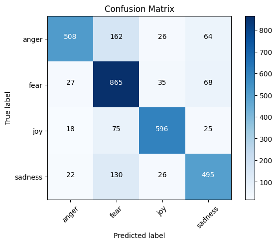
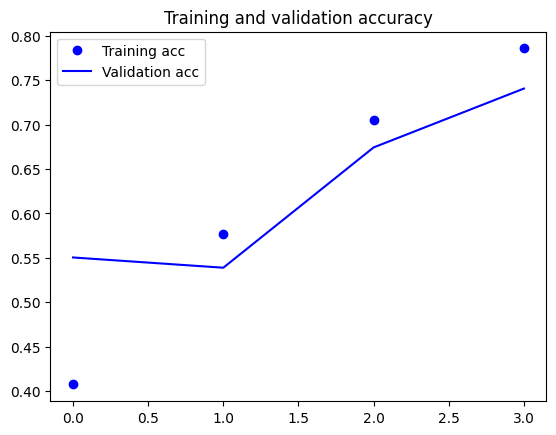

<center>
<h1>Deep Learning with Python</h1>
<h2>Final Project - Winter 2023</h2>
<h3>Name: Iro-Georgia Malta</h3>
</center>


## About the task:
The aim of this project is to build a **multi-class classification model** which will be trained on tweets that convey one of the following emotions: joy, sadness, anger or fear. The task is also a single-label classification since each sample requires one label (emotion). The dataset used for this project is the "Emotion Classification NLP" which can be found in kaggle (https://www.kaggle.com/datasets/anjaneyatripathi/emotion-classification-nlp?select=emotion-labels-train.csv). Identifying emotions in data (e.g., tweets, articles, reviews etc.) has become an integral part of many NLP and Data Science tasks such as text classification, sentiment analysis or automatic summarization. Additionally, analyzing the emotions expressed in a text can improve the performance of NLP systems predicting the context or the intent of a text. For the reasons mentioned above, I decided to build and train a neural model on this specific dataset.
<br>
For this project, besides building a multi-class classification model I will use the **One-vs-Rest** strategy to find which model (mutli-class classification model vs. binary classification model(s)) has higher accuracy and F-measure, and why this model has better predictions for the specific dataset.

## Import modules and set seed:
In this section, I import the modules that are used throughout the whole project. Modules or libraries which have to be imported at a specific point of the project, are not mentioned here. Addionally, I set a seed here in order to reproduce the same results. The function **reset_seeds()** must be called before training each model.


```python
# import necessary modules

import keras
import numpy as np
import tensorflow as tf
import random as python_random
```

    2023-03-01 00:44:54.586740: I tensorflow/core/platform/cpu_feature_guard.cc:193] This TensorFlow binary is optimized with oneAPI Deep Neural Network Library (oneDNN) to use the following CPU instructions in performance-critical operations:  AVX2 FMA
    To enable them in other operations, rebuild TensorFlow with the appropriate compiler flags.
    


```python
def reset_seeds():
   np.random.seed(123) 
   python_random.seed(123)
   tf.random.set_seed(1234)

reset_seeds()
```

## 1. Data Processing:

Before I start building the model(s), the dataset needs to be loaded and processed in order to be fed into the neural network(s). To load the dataset and to extract data I use **pandas** library:


```python
# import pandas library for extracting data
import pandas as pd
```

The dataset are three separate **csv-files**. The data from the csv-files are loaded and assigned to the following variables:


```python
# read_csv() method from pandas library

emotions_train_data = pd.read_csv("/compLing/students/courses/deepLearning/finalProject23/iro.malta/emotion-labels-train.csv") # train data
emotions_val_data = pd.read_csv("/compLing/students/courses/deepLearning/finalProject23/iro.malta/emotion-labels-val.csv") # validation data
emotions_test_data = pd.read_csv("/compLing/students/courses/deepLearning/finalProject23/iro.malta/emotion-labels-test.csv") # test data
```

The content of the three different datasets must be visualized in order to know which information needs to be extracted. The **head() function** is used and it shows the datasets contain **two columns**.


```python
# visualize train data

emotions_train_data.head()
```


<div>
<style scoped>
    .dataframe tbody tr th:only-of-type {
        vertical-align: middle;
    }

    .dataframe tbody tr th {
        vertical-align: top;
    }

    .dataframe thead th {
        text-align: right;
    }
</style>
<table border="1" class="dataframe">
  <thead>
    <tr style="text-align: right;">
      <th></th>
      <th>text</th>
      <th>label</th>
    </tr>
  </thead>
  <tbody>
    <tr>
      <th>0</th>
      <td>Just got back from seeing @GaryDelaney in Burs...</td>
      <td>joy</td>
    </tr>
    <tr>
      <th>1</th>
      <td>Oh dear an evening of absolute hilarity I don'...</td>
      <td>joy</td>
    </tr>
    <tr>
      <th>2</th>
      <td>Been waiting all week for this game ❤️❤️❤️ #ch...</td>
      <td>joy</td>
    </tr>
    <tr>
      <th>3</th>
      <td>@gardiner_love : Thank you so much, Gloria! Yo...</td>
      <td>joy</td>
    </tr>
    <tr>
      <th>4</th>
      <td>I feel so blessed to work with the family that...</td>
      <td>joy</td>
    </tr>
  </tbody>
</table>
</div>


```python
# visualize validation data

emotions_val_data.head()
```


<div>
<style scoped>
    .dataframe tbody tr th:only-of-type {
        vertical-align: middle;
    }

    .dataframe tbody tr th {
        vertical-align: top;
    }

    .dataframe thead th {
        text-align: right;
    }
</style>
<table border="1" class="dataframe">
  <thead>
    <tr style="text-align: right;">
      <th></th>
      <th>text</th>
      <th>label</th>
    </tr>
  </thead>
  <tbody>
    <tr>
      <th>0</th>
      <td>@theclobra lol I thought maybe, couldn't decid...</td>
      <td>joy</td>
    </tr>
    <tr>
      <th>1</th>
      <td>Nawaz Sharif is getting more funnier than @kap...</td>
      <td>joy</td>
    </tr>
    <tr>
      <th>2</th>
      <td>Nawaz Sharif is getting more funnier than @kap...</td>
      <td>joy</td>
    </tr>
    <tr>
      <th>3</th>
      <td>@tomderivan73 😁...I'll just people watch and e...</td>
      <td>joy</td>
    </tr>
    <tr>
      <th>4</th>
      <td>I love my family so much #lucky #grateful #sma...</td>
      <td>joy</td>
    </tr>
  </tbody>
</table>
</div>


```python
# visualize test data

emotions_test_data.head()
```


<div>
<style scoped>
    .dataframe tbody tr th:only-of-type {
        vertical-align: middle;
    }

    .dataframe tbody tr th {
        vertical-align: top;
    }

    .dataframe thead th {
        text-align: right;
    }
</style>
<table border="1" class="dataframe">
  <thead>
    <tr style="text-align: right;">
      <th></th>
      <th>text</th>
      <th>label</th>
    </tr>
  </thead>
  <tbody>
    <tr>
      <th>0</th>
      <td>You must be knowing #blithe means (adj.)  Happ...</td>
      <td>joy</td>
    </tr>
    <tr>
      <th>1</th>
      <td>Old saying 'A #smile shared is one gained for ...</td>
      <td>joy</td>
    </tr>
    <tr>
      <th>2</th>
      <td>Bridget Jones' Baby was bloody hilarious 😅 #Br...</td>
      <td>joy</td>
    </tr>
    <tr>
      <th>3</th>
      <td>@Elaminova sparkling water makes your life spa...</td>
      <td>joy</td>
    </tr>
    <tr>
      <th>4</th>
      <td>I'm tired of everybody telling me to chill out...</td>
      <td>joy</td>
    </tr>
  </tbody>
</table>
</div>


Then, I iterate through the column labels to make sure about the **column labels** (text, label) and **the number of columns** (2):


```python
for col in emotions_train_data.columns:
    print(col)
```

    text
    label
    

## 2. Label Encoding:

The samples of the three datasets are assigned with the following labels: **joy, sadness, anger and fear**. The format of these labels is not appropriate to be used by a neural network and thus, I convert the labels to classes **0-3**. To encode the labels I use the **preprocessing.LabelEncoder** from **scikit-learn**:


```python
# find the unique elements of the column 'label' in the datasets

emotions_train_data['label'].unique() # train data
```


    array(['joy', 'fear', 'anger', 'sadness'], dtype=object)


```python
emotions_val_data['label'].unique() # validation data
```


    array(['joy', 'fear', 'anger', 'sadness'], dtype=object)


```python
emotions_test_data['label'].unique() # test data
```


    array(['joy', 'fear', 'anger', 'sadness'], dtype=object)


All three datasets contain the labels: **joy, fear, anger and sadness**. An additional step of exploring the data of the column 'label' is to **count the instances of each label** in the datasets. For this reason, I use the **value_counts()** function on the datasets:


```python
count_labels_train = emotions_train_data['label'].value_counts()
print(count_labels_train)
```

    fear       1147
    anger       857
    joy         823
    sadness     786
    Name: label, dtype: int64
    


```python
count_labels_val = emotions_val_data['label'].value_counts()
print(count_labels_val)
```

    fear       110
    anger       84
    joy         79
    sadness     74
    Name: label, dtype: int64
    


```python
count_labels_test = emotions_test_data['label'].value_counts()
print(count_labels_test)
```

    fear       995
    anger      760
    joy        714
    sadness    673
    Name: label, dtype: int64
    

The **value_counts()** function returns the instances of each label in a **descending order**. It is observed that the label **'fear'** has the most counts, then the label **'anger'** comes second, and lastly **'joy'** and **'sadness'**. From the label counts, it is also apparent that the train dataset and the test dataset have more samples than the validation dataset.


```python
# check if the sum of the value counts is equal to the length of all the labels of the train dataset

sum(count_labels_train) == len(emotions_train_data['label'])
```


    True


At this point, I import the **preprocessing.LabelEncoder** from **scikit-learn** to encode the labels to classes **0-3**:


```python
# import label encoder from scikit-learn

from sklearn import preprocessing
```

I create an extra column with the title **'label_class'** in all three datasets. In this way, I can associate the classes **0-3** with each emotion:


```python
label_encoder = preprocessing.LabelEncoder() # assign LabelEncoder object 

# create column 'label_class' and encode the emotion labels of column 'label'
emotions_train_data['label_class'] = label_encoder.fit_transform(emotions_train_data['label']) # train data
emotions_val_data['label_class'] = label_encoder.fit_transform(emotions_val_data['label']) # validation data
emotions_test_data['label_class'] = label_encoder.fit_transform(emotions_test_data['label']) # test data
```

Now, column **'label_class'** has the classes **0-3** as unique elements in all datasets:


```python
# check the unique elements of the column 'label_class'

emotions_train_data['label_class'].unique() # train data
```


    array([2, 1, 0, 3])


```python
emotions_val_data['label_class'].unique() # validation data
```


    array([2, 1, 0, 3])


```python
emotions_test_data['label_class'].unique() # test data
```


    array([2, 1, 0, 3])


The extra column **'label_class'** can be found now in the datasets. Here, I check the extra column in the train dataset:


```python
emotions_train_data.head() # train data
```


<div>
<style scoped>
    .dataframe tbody tr th:only-of-type {
        vertical-align: middle;
    }

    .dataframe tbody tr th {
        vertical-align: top;
    }

    .dataframe thead th {
        text-align: right;
    }
</style>
<table border="1" class="dataframe">
  <thead>
    <tr style="text-align: right;">
      <th></th>
      <th>text</th>
      <th>label</th>
      <th>label_class</th>
    </tr>
  </thead>
  <tbody>
    <tr>
      <th>0</th>
      <td>Just got back from seeing @GaryDelaney in Burs...</td>
      <td>joy</td>
      <td>2</td>
    </tr>
    <tr>
      <th>1</th>
      <td>Oh dear an evening of absolute hilarity I don'...</td>
      <td>joy</td>
      <td>2</td>
    </tr>
    <tr>
      <th>2</th>
      <td>Been waiting all week for this game ❤️❤️❤️ #ch...</td>
      <td>joy</td>
      <td>2</td>
    </tr>
    <tr>
      <th>3</th>
      <td>@gardiner_love : Thank you so much, Gloria! Yo...</td>
      <td>joy</td>
      <td>2</td>
    </tr>
    <tr>
      <th>4</th>
      <td>I feel so blessed to work with the family that...</td>
      <td>joy</td>
      <td>2</td>
    </tr>
  </tbody>
</table>
</div>


Now, I use the **value_counts()** function on the train dataset to associate the emotion labels with the label classes. The function returns the associated pairs as well as their counts in the dataset:


```python
emotions_train_data[['label', 'label_class']].value_counts()
```


    label    label_class
    fear     1              1147
    anger    0               857
    joy      2               823
    sadness  3               786
    dtype: int64


The associated pairs between the emotions and the classes are: **anger - 0, fear - 1, joy - 2 and sadness - 3**. 

## 3. Conversion of data and labels into numerical formats:

I extract the necessary information, **text** and **label_class**, from the three datasets. I put the extracted samples and labels into lists for easier manipulation in the next steps:


```python
# train data
emotions_train_list = emotions_train_data['text'].tolist()
emotions_train_labels = emotions_train_data['label_class'].tolist()

# validation data
emotions_val_list = emotions_val_data['text'].tolist()
emotions_val_labels = emotions_val_data['label_class'].tolist()

# test data
emotions_test_list = emotions_test_data['text'].tolist()
emotions_test_labels = emotions_test_data['label_class'].tolist()
```

Now, I calculate the **average sentence length** (the mean of sentences length) in the train dataset:


```python
# the mean of sentences length in the train data

sentence_length = []

for l in emotions_train_list:
    sentence_length.append(len(l.split(' ')))
    
sentence_mean = np.mean(sentence_length) # the mean is 16
print(sentence_mean)
```

    16.272349847771935
    

Additionally, I plot a histogram with the **max lengths** of the sentences and **their instences** in the train dataset (counts); I also plot **the mean of sentences length**. For the histogram, the **Matplotlib** library is used. 


```python
# import matplotlib to visualize max length of sentences

import matplotlib.pyplot as plt

x = np.array(sentence_length) # convert the list to numpy array

plt.hist(x, color="skyblue", ec="white", lw=1, density=False, bins=20) # density=False for counts
plt.ylabel('Counts')
plt.xlabel('Max_length')
plt.axvline(x.mean(), color='k', linestyle='dashed', linewidth=1) # plot the mean of x
```


    <matplotlib.lines.Line2D at 0x7f9d1a39f8e0>


    

    


The histogram shows that the **max length** of the setences is around **32**. It also depicts that **the max length of most sentences** can be found around **16** and **24**. Therefore, **the mean of sentences length** is plotted close to **16** which proves that the previous calculation of the mean is correct.
<br>
Additionally, I calculate **the counts** of the sentences for each max length in the train dataset to see which sentence length has the most sentences:


```python
sentence_count = {}

for c in sentence_length:
    if c in sentence_count.keys():
        sentence_count[c]+=1
    else:
        sentence_count[c]=1

print(sentence_count)
```

    {17: 174, 20: 191, 11: 141, 24: 186, 22: 184, 10: 139, 8: 138, 6: 112, 5: 74, 19: 203, 21: 178, 7: 131, 13: 125, 23: 179, 12: 166, 18: 169, 14: 140, 15: 151, 25: 133, 16: 155, 9: 164, 26: 116, 4: 62, 27: 59, 30: 10, 3: 36, 29: 29, 28: 43, 32: 2, 2: 17, 31: 5, 58: 1}
    

From the counts shown above, most sentences have max length between **16** and **24**. The max length **19** has the most counts of sentences **203**. There is only one sentence of length **58** and thus, it is not depicted in the histogram.
<br>
I also check sentence lengths normality in the dataset to see if the dataset follows a normal distribution and to determine the max length of sentences for sequence padding more accurately. For this reason, I use **the probability density function** for norm from **scipy.stats**:


```python
from scipy.stats import norm

x, bins, y = plt.hist(sentence_length, 20, density=True) # density=True for propability density
mu = np.mean(sentence_length) # mean
sigma = np.std(sentence_length) # SD
plt.ylabel('Probability_density')
plt.xlabel('Max_length')
plt.plot(bins, norm.pdf(bins, mu, sigma)) # plot normal probability density
```


    [<matplotlib.lines.Line2D at 0x7f9d16ce4190>]


    

    


According to the histogram above, it is depicted that there are many sentences with max length higher than **16**. Therefore, cutting the sentences at length **16** might result to losing some valuable information of the sentences. For this reason, I decide to cut the tweets after **30** words and thus, more data will be included in the training process of the model. 
<br>
Before I start with **sequence padding**, **tokenization** process of the text data takes place first. I only consider the **10.000** most frequent words and thus, I set the parameter *num_words* to *10000* in the Tokenizer():


```python
# import tokenizer and padding

from keras.preprocessing.text import Tokenizer
from keras.utils import pad_sequences
from tensorflow.keras.utils import to_categorical
```


```python
# cut the tweets after 30 words
max_length = 30

# consider 10,000 most frequent words for tokenization
max_words = 10000

# tokenize the datasets and set num_words parameter = max_words
tokenizer = Tokenizer(num_words = max_words)
tokenizer.fit_on_texts(emotions_train_list) # train data
tokenizer.fit_on_texts(emotions_val_list) # validation data
tokenizer.fit_on_texts(emotions_test_list) # test data

sequences_train = tokenizer.texts_to_sequences(emotions_train_list)
sequences_val = tokenizer.texts_to_sequences(emotions_val_list)
sequences_test = tokenizer.texts_to_sequences(emotions_test_list)

# find number of unique tokens
word_index = tokenizer.word_index
print('Found %s unique tokens.' % len(word_index))
```

    Found 17080 unique tokens.
    

Now that the sentences from the three datasets are tokenized, the **sequence padding** process can be performed on the datasets:


```python
# pad sequences to the same length, max_length = 30
train_np_data = pad_sequences(sequences_train, maxlen = max_length)
print('Shape of train data tensor:', train_np_data.shape)

val_np_data = pad_sequences(sequences_val, maxlen = max_length)
print('Shape of validation data tensor:', val_np_data.shape)

test_np_data = pad_sequences(sequences_test, maxlen = max_length)
print('Shape of test data tensor:', test_np_data.shape)
```

    Shape of train data tensor: (3613, 30)
    Shape of validation data tensor: (347, 30)
    Shape of test data tensor: (3142, 30)
    

The sentences of the datasets are now converted **into numerical formats**. At this point, I convert the **class labels** into numpy arrays and then, into **one-hot encoding** format:


```python
# convert the labels into numpy arrays and then, into one-hot encoding

labels_one_hot_train = np.asarray(emotions_train_labels) # train data
labels_one_hot_train = to_categorical(labels_one_hot_train)
print('Shape of label tensor:', labels_one_hot_train.shape)

labels_one_hot_val = np.asarray(emotions_val_labels) # validation data
labels_one_hot_val = to_categorical(labels_one_hot_val)
print('Shape of label tensor:', labels_one_hot_val.shape)

labels_one_hot_test = np.asarray(emotions_test_labels) # test data
labels_one_hot_test = to_categorical(labels_one_hot_test)
print('Shape of label tensor:', labels_one_hot_test.shape)
```

    Shape of label tensor: (3613, 4)
    Shape of label tensor: (347, 4)
    Shape of label tensor: (3142, 4)
    

For the model's training process, I shuffle the text data of the **train dataset** as well as the corresponding labels:


```python
# shuffle the train dataset

indices = np.arange(train_np_data.shape[0]) # train data
np.random.shuffle(indices)
train_np_data = train_np_data[indices]
labels_one_hot_train = labels_one_hot_train[indices]
```

Now that the tweets as well as the class labels are converted into numerical formats, they are assigned to new variables which will be used later by the modelfor the model's training and testing processes:


```python
# train data
x_train = train_np_data
y_train = labels_one_hot_train

# validation data
x_val = val_np_data
y_val = labels_one_hot_val

# test data
x_test = test_np_data
y_test = labels_one_hot_test
```


```python
# check if the sum of the splitted data is equal to the sum of all the data

len(x_train) + len(x_val) + len(x_test) == len(train_np_data) + len(val_np_data) + len(test_np_data)
```


    True


## 4. Word Embeddings

For the models training process I use the pre-trained GloVe embeddings which are trained on **Twitter data** and they are represented with **200** dimensions vectors. The file of the embeddings is **'glove.twitter.27B.200d.txt'** and it can be found in this website (https://nlp.stanford.edu/projects/glove/). 
<br>
First, I read in the file containing the embeddings and then, I pre-process the embeddings so that they can be loaded into the models:


```python
import os 

glove_path = '/compLing/students/courses/deepLearning/finalProject23/iro.malta/'


embeddings_index = {}

file_txt = open(os.path.join(glove_path, 'glove.twitter.27B.200d.txt'))
for line in file_txt:
    values = line.split()
    word = values[0]
    coefs = np.asarray(values[1:], dtype='float32')
    embeddings_index[word] = coefs
file_txt.close()

print('Found %s word vectors.' % len(embeddings_index))
```

    Found 1193514 word vectors.
    


```python
embedding_dim = 200 # 200d vectors

embedding_matrix = np.zeros((max_words, embedding_dim)) 
for word, i in word_index.items(): # iterate through the tokens 
    embedding_vector = embeddings_index.get(word) # return the value of the key
    if i < max_words:
        if embedding_vector is not None:
            # Words not found in embedding index will be all-zeros.
            embedding_matrix[i] = embedding_vector
```

## 5. Multi-class classification Model Setup, Training and Testing


```python
# import modules for building the models, plots, evaluation & confusion matrices

from keras.models import Sequential
from keras.layers import Embedding, Dense, LSTM
import matplotlib.pyplot as plt
import sklearn
from sklearn.metrics import f1_score
from sklearn.metrics import confusion_matrix
from sklearn.metrics import classification_report
%matplotlib inline
from sklearn.metrics import confusion_matrix
import itertools
```


```python
# function to produce a confusion matrix

def plot_confusion_matrix(cm, classes,
                        normalize=False,
                        title='Confusion matrix',
                        cmap=plt.cm.Blues):
    """
    This function prints and plots the confusion matrix.
    Normalization can be applied by setting `normalize=True`.
    """
    plt.imshow(cm, interpolation='nearest', cmap=cmap)
    plt.title(title)
    plt.colorbar()
    tick_marks = np.arange(len(classes))
    plt.xticks(tick_marks, classes, rotation=45)
    plt.yticks(tick_marks, classes)

    if normalize:
        cm = cm.astype('float') / cm.sum(axis=1)[:, np.newaxis]
        print("Normalized confusion matrix")
    else:
        print('Confusion matrix, without normalization')

    print(cm)

    thresh = cm.max() / 2.
    for i, j in itertools.product(range(cm.shape[0]), range(cm.shape[1])):
        plt.text(j, i, cm[i, j],
            horizontalalignment="center",
            color="white" if cm[i, j] > thresh else "black")

    plt.tight_layout()
    plt.ylabel('True label')
    plt.xlabel('Predicted label')
```

### 5.1. First multi-class classification model:
### Vanilla LSTM models
I set up a **Sequential model** that contains an **Embedding layer** and one hidden **LSTM layer** with **128** units. On the **Embedding layer** the pre-trained embeddings are loaded. The model also contains a **Dense layer** as the output layer, and the layer has **4** output units since the model classifies **4** different types of emotions (anger, fear, joy and sadness). Additionally, I use the **softmax** activation function on the **Dense layer** because the **softmax** function is appropriate for multi-class classification problems with mutually exclusive classes such as this one.


```python
model = Sequential()
model.add(Embedding(max_words, embedding_dim, input_length = max_length))
model.add(LSTM(128))
model.add(Dense(4, activation='softmax'))
model.summary()
```

    2023-03-01 00:48:23.163126: E tensorflow/compiler/xla/stream_executor/cuda/cuda_driver.cc:267] failed call to cuInit: CUDA_ERROR_NO_DEVICE: no CUDA-capable device is detected
    2023-03-01 00:48:23.163158: I tensorflow/compiler/xla/stream_executor/cuda/cuda_diagnostics.cc:169] retrieving CUDA diagnostic information for host: hulk
    2023-03-01 00:48:23.163163: I tensorflow/compiler/xla/stream_executor/cuda/cuda_diagnostics.cc:176] hostname: hulk
    2023-03-01 00:48:23.163210: I tensorflow/compiler/xla/stream_executor/cuda/cuda_diagnostics.cc:200] libcuda reported version is: 470.141.3
    2023-03-01 00:48:23.163224: I tensorflow/compiler/xla/stream_executor/cuda/cuda_diagnostics.cc:204] kernel reported version is: 470.141.3
    2023-03-01 00:48:23.163228: I tensorflow/compiler/xla/stream_executor/cuda/cuda_diagnostics.cc:310] kernel version seems to match DSO: 470.141.3
    2023-03-01 00:48:23.163515: I tensorflow/core/platform/cpu_feature_guard.cc:193] This TensorFlow binary is optimized with oneAPI Deep Neural Network Library (oneDNN) to use the following CPU instructions in performance-critical operations:  AVX2 FMA
    To enable them in other operations, rebuild TensorFlow with the appropriate compiler flags.
    

    Model: "sequential"
    _________________________________________________________________
     Layer (type)                Output Shape              Param #   
    =================================================================
     embedding (Embedding)       (None, 30, 200)           2000000   
                                                                     
     lstm (LSTM)                 (None, 128)               168448    
                                                                     
     dense (Dense)               (None, 4)                 516       
                                                                     
    =================================================================
    Total params: 2,168,964
    Trainable params: 2,168,964
    Non-trainable params: 0
    _________________________________________________________________
    

I load the GloVe matrix which was prepared into the **Embedding layer**. Additionally, I set the parameter **trainable** to **True** so that the pre-trained embeddings adapt better to the specific training set. I also tried setting the parameter **trainable** to **False**, but the model performed worse. Thus, in all the models the parameter **trainable** of the pre-trained embeddings is set to **True**.


```python
model.layers[0].set_weights([embedding_matrix])
model.layers[0].trainable = True
```

For the training process, I use the **RMSProp** algorithm for optimization, and I choose **categoricalCrossentropy** as loss function for the model because the specific task has more than two label classes (e.g., 0, 1, 2, 3). Additionaly, I choose accuracy as metric to monitor the model's performance during training. 
<br>
I fit the model to the training data and the training labels, I train the model over **5** epochs, and I group the data into batches of size **32**. The data for validation are also specified.


```python
model.compile(optimizer='rmsprop', 
              loss='categorical_crossentropy', # the task is a mutli-class classification
              metrics=['acc'])

history = model.fit(x_train, y_train, # training/ fitting the model
                    epochs=5,
                    batch_size=32,
                    validation_data=(x_val, y_val), # specify validation data
                    verbose = 1)
```

    Epoch 1/5
    113/113 [==============================] - 5s 30ms/step - loss: 1.0931 - acc: 0.5472 - val_loss: 0.9194 - val_acc: 0.6571
    Epoch 2/5
    113/113 [==============================] - 3s 26ms/step - loss: 0.6987 - acc: 0.7396 - val_loss: 0.7619 - val_acc: 0.7032
    Epoch 3/5
    113/113 [==============================] - 3s 26ms/step - loss: 0.4553 - acc: 0.8381 - val_loss: 0.7139 - val_acc: 0.7608
    Epoch 4/5
    113/113 [==============================] - 3s 27ms/step - loss: 0.2956 - acc: 0.8965 - val_loss: 0.9027 - val_acc: 0.7262
    Epoch 5/5
    113/113 [==============================] - 3s 26ms/step - loss: 0.2113 - acc: 0.9261 - val_loss: 0.6711 - val_acc: 0.7723
    


```python
test_loss, test_acc = model.evaluate(x_test, y_test)
```

    99/99 [==============================] - 1s 12ms/step - loss: 0.6795 - acc: 0.7868
    


```python
# plotting training/ validation accuracy and training/ validation loss

acc = history.history['acc']
val_acc = history.history['val_acc']
loss = history.history['loss']
val_loss = history.history['val_loss']

epochs = range(len(acc))

plt.plot(epochs, acc, 'bo', label='Training acc')
plt.plot(epochs, val_acc, 'b', label='Validation acc')
plt.title('Training and validation accuracy')
plt.legend()

plt.figure()

plt.plot(epochs, loss, 'bo', label='Training loss')
plt.plot(epochs, val_loss, 'b', label='Validation loss')
plt.title('Training and validation loss')
plt.legend()

plt.show()
```


    

    


    

    


### Summary of results:
From the metrics **validation accuracy** and **validation loss**, it is apparent that there is overfitting in the data after epoch **3**. Thus, I would stop training the model at epoch **3**, where the **validation loss** is the lowest. In the test data a **~78%** test accuracy is gained; however, the model performs better on the training data (~92%) than on the test data, which signals an instance of overfitting. Thus, I decide to change the parameters in the second model to improve its performance.

### 5.2. Second multi-class classification model: 
The set up of the second model is similar to the first one: it is a **Sequential model**, containing an **Embedding layer** and one hidden **LSTM layer** with **64** units. It also contains a **Dense layer** as the output layer, with **4** output units and **softmax** activation function is used on it.


```python
model_2 = Sequential()
model_2.add(Embedding(max_words, embedding_dim, input_length = max_length))
model_2.add(LSTM(64))
model_2.add(Dense(4, activation='softmax'))
model_2.summary()
```

    Model: "sequential_1"
    _________________________________________________________________
     Layer (type)                Output Shape              Param #   
    =================================================================
     embedding_1 (Embedding)     (None, 30, 200)           2000000   
                                                                     
     lstm_1 (LSTM)               (None, 64)                67840     
                                                                     
     dense_1 (Dense)             (None, 4)                 260       
                                                                     
    =================================================================
    Total params: 2,068,100
    Trainable params: 2,068,100
    Non-trainable params: 0
    _________________________________________________________________
    


```python
# load the GloVe matrix
model_2.layers[0].set_weights([embedding_matrix])
model_2.layers[0].trainable = True
```

The set up for the model's training is the same as the one of the first model. However, this time I reduce the training **epochs** to **3**:


```python
model_2.compile(optimizer='rmsprop', 
              loss='categorical_crossentropy', # the task is a mutli-class classification
              metrics=['acc'])

history_2 = model_2.fit(x_train, y_train, # training/ fitting the model
                    epochs=3,
                    batch_size=32,
                    validation_data=(x_val, y_val), # specify validation data
                    verbose = 1)
```

    Epoch 1/3
    113/113 [==============================] - 4s 20ms/step - loss: 1.1260 - acc: 0.5262 - val_loss: 0.9943 - val_acc: 0.5965
    Epoch 2/3
    113/113 [==============================] - 2s 17ms/step - loss: 0.7379 - acc: 0.7401 - val_loss: 0.8210 - val_acc: 0.6657
    Epoch 3/3
    113/113 [==============================] - 2s 16ms/step - loss: 0.4782 - acc: 0.8339 - val_loss: 0.7419 - val_acc: 0.7522
    


```python
test_loss, test_acc = model_2.evaluate(x_test, y_test)
```

    99/99 [==============================] - 1s 6ms/step - loss: 0.6693 - acc: 0.7578
    


```python
# plotting training/ validation accuracy and training/ validation loss

import matplotlib.pyplot as plt

acc = history_2.history['acc']
val_acc = history_2.history['val_acc']
loss = history_2.history['loss']
val_loss = history_2.history['val_loss']

epochs = range(len(acc))

plt.plot(epochs, acc, 'bo', label='Training acc')
plt.plot(epochs, val_acc, 'b', label='Validation acc')
plt.title('Training and validation accuracy')
plt.legend()

plt.figure()

plt.plot(epochs, loss, 'bo', label='Training loss')
plt.plot(epochs, val_loss, 'b', label='Validation loss')
plt.title('Training and validation loss')
plt.legend()

plt.show()
```


    

    


    

    


### Summary of results:
According to the metrics **validation accuracy** and **validation loss**, this time there is not overfitting in the validation dataset. However, there is still overfitting in the test dataset: **~75%** test accuracy is gained, while maximum accuracy of **~83%** is gained during training.
<br>
In comparison to the previous model, the second model has achieved a bit lower **loss** **~66%** in the test dataset. The results of both models are very similar and overall, the models do not perform well when looking at both the **validation loss** and **test loss** of the models. Therefore, I decide to build another model with fewer units in the hidden layer to see if the model will perform better.

### 5.3. Third multi-class classification model:

The third model's set up is similar to the previous two models; the only difference is the number of units used in the hidden **LSTM layer**, which is **32** in this model:


```python
model_3 = Sequential()
model_3.add(Embedding(max_words, embedding_dim, input_length = max_length))
model_3.add(LSTM(32))
model_3.add(Dense(4, activation='softmax'))
model_3.summary()
```

    Model: "sequential_2"
    _________________________________________________________________
     Layer (type)                Output Shape              Param #   
    =================================================================
     embedding_2 (Embedding)     (None, 30, 200)           2000000   
                                                                     
     lstm_2 (LSTM)               (None, 32)                29824     
                                                                     
     dense_2 (Dense)             (None, 4)                 132       
                                                                     
    =================================================================
    Total params: 2,029,956
    Trainable params: 2,029,956
    Non-trainable params: 0
    _________________________________________________________________
    


```python
# load the GloVe matrix
model_3.layers[0].set_weights([embedding_matrix])
model_3.layers[0].trainable = True
```

The model's parameters during training are similar to the previous two models. I train the model for **5** epochs to observe whether overfitting occurs at epoch **4**:


```python
model_3.compile(optimizer='rmsprop', 
              loss='categorical_crossentropy', # the task is a mutli-class classification
              metrics=['acc'])

history_3 = model_3.fit(x_train, y_train, # training/ fitting the model
                    epochs=5,
                    batch_size=32,
                    validation_data=(x_val, y_val), # specify validation data
                    verbose = 1)
```

    Epoch 1/5
    113/113 [==============================] - 3s 19ms/step - loss: 1.2013 - acc: 0.4913 - val_loss: 1.0791 - val_acc: 0.5648
    Epoch 2/5
    113/113 [==============================] - 2s 14ms/step - loss: 0.8495 - acc: 0.6928 - val_loss: 0.8949 - val_acc: 0.6427
    Epoch 3/5
    113/113 [==============================] - 2s 14ms/step - loss: 0.5780 - acc: 0.7980 - val_loss: 0.7579 - val_acc: 0.7320
    Epoch 4/5
    113/113 [==============================] - 2s 14ms/step - loss: 0.3873 - acc: 0.8683 - val_loss: 0.8000 - val_acc: 0.7147
    Epoch 5/5
    113/113 [==============================] - 2s 14ms/step - loss: 0.2754 - acc: 0.9092 - val_loss: 0.6599 - val_acc: 0.7522
    


```python
test_loss, test_acc = model_3.evaluate(x_test, y_test)
```

    99/99 [==============================] - 0s 4ms/step - loss: 0.6220 - acc: 0.7823
    


```python
import matplotlib.pyplot as plt

acc = history_3.history['acc']
val_acc = history_3.history['val_acc']
loss = history_3.history['loss']
val_loss = history_3.history['val_loss']

epochs = range(len(acc))

plt.plot(epochs, acc, 'bo', label='Training acc')
plt.plot(epochs, val_acc, 'b', label='Validation acc')
plt.title('Training and validation accuracy')
plt.legend()

plt.figure()

plt.plot(epochs, loss, 'bo', label='Training loss')
plt.plot(epochs, val_loss, 'b', label='Validation loss')
plt.title('Training and validation loss')
plt.legend()

plt.show()
```


    

    


    

    


### Summary of results:
As it was predicted, overfitting occurs after **3** or **4** epochs in the validation dataset. However, lower **validation loss** is gained at epoch **4** around **59%**, comparing to the previous models. Thus, the reduction of the units in the hidden layer plays a role in the model's performance.
<br>
I run the same model again; however, this time I train it for **4** epochs to compare the results of the test dataset:


```python
model_3b = Sequential()
model_3b.add(Embedding(max_words, embedding_dim, input_length = max_length))
model_3b.add(LSTM(32))
model_3b.add(Dense(4, activation='softmax'))
model_3b.summary()
```

    Model: "sequential_3"
    _________________________________________________________________
     Layer (type)                Output Shape              Param #   
    =================================================================
     embedding_3 (Embedding)     (None, 30, 200)           2000000   
                                                                     
     lstm_3 (LSTM)               (None, 32)                29824     
                                                                     
     dense_3 (Dense)             (None, 4)                 132       
                                                                     
    =================================================================
    Total params: 2,029,956
    Trainable params: 2,029,956
    Non-trainable params: 0
    _________________________________________________________________
    


```python
# load the GloVe matrix
model_3b.layers[0].set_weights([embedding_matrix])
model_3b.layers[0].trainable = True
```


```python
model_3b.compile(optimizer='rmsprop', 
              loss='categorical_crossentropy', # the task is a mutli-class classification
              metrics=['acc'])

history_3b = model_3b.fit(x_train, y_train, # training/ fitting the model
                    epochs=4,
                    batch_size=32,
                    validation_data=(x_val, y_val), # specify validation data
                    verbose = 1)
```

    Epoch 1/4
    113/113 [==============================] - 3s 18ms/step - loss: 1.1871 - acc: 0.4940 - val_loss: 1.0581 - val_acc: 0.5937
    Epoch 2/4
    113/113 [==============================] - 2s 15ms/step - loss: 0.8487 - acc: 0.6914 - val_loss: 0.9054 - val_acc: 0.6455
    Epoch 3/4
    113/113 [==============================] - 2s 14ms/step - loss: 0.5767 - acc: 0.7963 - val_loss: 0.8047 - val_acc: 0.7061
    Epoch 4/4
    113/113 [==============================] - 2s 14ms/step - loss: 0.3894 - acc: 0.8669 - val_loss: 0.7269 - val_acc: 0.7320
    


```python
test_loss, test_acc = model_3b.evaluate(x_test, y_test)
```

    99/99 [==============================] - 0s 4ms/step - loss: 0.6488 - acc: 0.7651
    


```python
import matplotlib.pyplot as plt

acc = history_3b.history['acc']
val_acc = history_3b.history['val_acc']
loss = history_3b.history['loss']
val_loss = history_3b.history['val_loss']

epochs = range(len(acc))

plt.plot(epochs, acc, 'bo', label='Training acc')
plt.plot(epochs, val_acc, 'b', label='Validation acc')
plt.title('Training and validation accuracy')
plt.legend()

plt.figure()

plt.plot(epochs, loss, 'bo', label='Training loss')
plt.plot(epochs, val_loss, 'b', label='Validation loss')
plt.title('Training and validation loss')
plt.legend()

plt.show()
```


    

    


    

    


### Summary of results:
The model's performance, in the validation and the test dataset, is again very similar to the previous models' performance. A lower loss **~61%** is gained in the test dataset, but the difference is not significant. Additionally, there is still overfitting between the maximum accuracy of the test dataset **~78%** and the training dataset **~88%**.

### 5.4. Fourth multi-class classification model
### Vanilla LSTM model with dropout rate = 0.5
The taining set up of this model is similar to the previous (three) models; however this time, I set the **dropout** argument of the hidden **LSTM** layer to **0.5**. I also tried other dropout rates, starting from **0.1**, and I found out that the model performs better with **0.5** dropout rate:


```python
model_4 = Sequential()
model_4.add(Embedding(max_words, embedding_dim, input_length = max_length))
model_4.add(LSTM(32, dropout=0.5))
model_4.add(Dense(4, activation='softmax'))
model_4.summary()
```

    Model: "sequential_4"
    _________________________________________________________________
     Layer (type)                Output Shape              Param #   
    =================================================================
     embedding_4 (Embedding)     (None, 30, 200)           2000000   
                                                                     
     lstm_4 (LSTM)               (None, 32)                29824     
                                                                     
     dense_4 (Dense)             (None, 4)                 132       
                                                                     
    =================================================================
    Total params: 2,029,956
    Trainable params: 2,029,956
    Non-trainable params: 0
    _________________________________________________________________
    


```python
# load the GloVe matrix
model_4.layers[0].set_weights([embedding_matrix])
model_4.layers[0].trainable = True
```

I train the model for **5** epochs and I reduce the batch size of the data from **32** to **16**:


```python
model_4.compile(optimizer='rmsprop', 
              loss='categorical_crossentropy', # the task is a mutli-class classification
              metrics=['acc'])

history_4 = model_4.fit(x_train, y_train, # training/ fitting the model
                    epochs=5,
                    batch_size=16,
                    validation_data=(x_val, y_val), # specify validation data
                    verbose = 1)
```

    Epoch 1/5
    226/226 [==============================] - 5s 16ms/step - loss: 1.2388 - acc: 0.4476 - val_loss: 1.0724 - val_acc: 0.6023
    Epoch 2/5
    226/226 [==============================] - 3s 14ms/step - loss: 0.9948 - acc: 0.6001 - val_loss: 0.9368 - val_acc: 0.6225
    Epoch 3/5
    226/226 [==============================] - 3s 14ms/step - loss: 0.7996 - acc: 0.6975 - val_loss: 0.8209 - val_acc: 0.6888
    Epoch 4/5
    226/226 [==============================] - 3s 14ms/step - loss: 0.6455 - acc: 0.7465 - val_loss: 0.7320 - val_acc: 0.7493
    Epoch 5/5
    226/226 [==============================] - 3s 14ms/step - loss: 0.5244 - acc: 0.8054 - val_loss: 0.6660 - val_acc: 0.7810
    


```python
test_loss, test_acc = model_4.evaluate(x_test, y_test)
```

    99/99 [==============================] - 0s 4ms/step - loss: 0.6221 - acc: 0.7842
    


```python
acc = history_4.history['acc']
val_acc = history_4.history['val_acc']
loss = history_4.history['loss']
val_loss = history_4.history['val_loss']

epochs = range(len(acc))

plt.plot(epochs, acc, 'bo', label='Training acc')
plt.plot(epochs, val_acc, 'b', label='Validation acc')
plt.title('Training and validation accuracy')
plt.legend()

plt.figure()

plt.plot(epochs, loss, 'bo', label='Training loss')
plt.plot(epochs, val_loss, 'b', label='Validation loss')
plt.title('Training and validation loss')
plt.legend()

plt.show()
```


    

    


    

    


```python
y_pred_4 = model_4.predict(x_test)
print(y_pred_4)
```

    99/99 [==============================] - 1s 4ms/step
    [[3.0735903e-04 1.1869852e-03 9.9770802e-01 7.9760625e-04]
     [1.8584831e-02 3.7021093e-02 9.1671491e-01 2.7679158e-02]
     [1.6106941e-02 5.2692007e-02 9.1841912e-01 1.2781911e-02]
     ...
     [5.1885888e-02 2.8938466e-01 6.1413404e-03 6.5258807e-01]
     [6.2793076e-02 3.4549147e-01 2.4747491e-02 5.6696796e-01]
     [5.4881810e-03 7.0243582e-02 2.1146999e-03 9.2215359e-01]]
    


```python
y_pred_4 = np.argmax(y_pred_4, axis=1)
y_test_4 =np.argmax(y_test, axis=1)
cm4 = confusion_matrix(y_test_4, y_pred_4)
print(cm4)
```

    [[508 162  26  64]
     [ 27 865  35  68]
     [ 18  75 596  25]
     [ 22 130  26 495]]
    


```python
sklearn.metrics.f1_score(y_test_4, y_pred_4, average='macro')
```


    0.7845763238990966


```python
report_4 = classification_report(y_test_4, y_pred_4, labels=[0,1,2,3], target_names=["anger", "fear", "joy", "sadness"])
print(report_4)
```

                  precision    recall  f1-score   support
    
           anger       0.88      0.67      0.76       760
            fear       0.70      0.87      0.78       995
             joy       0.87      0.83      0.85       714
         sadness       0.76      0.74      0.75       673
    
        accuracy                           0.78      3142
       macro avg       0.80      0.78      0.78      3142
    weighted avg       0.80      0.78      0.78      3142
    
    


```python
plot_confusion_matrix(cm=cm4, classes=["anger", "fear", "joy", "sadness"], title='Confusion Matrix')
```

    Confusion matrix, without normalization
    [[508 162  26  64]
     [ 27 865  35  68]
     [ 18  75 596  25]
     [ 22 130  26 495]]
    


    

    


### Summary of results:
xxxxxx

### 5.5. Fifth multi-class classification model
### Stacked LSTM model with dropout rate = 0.4
Since changing only the units in the hidden layer, doesn't make any significant difference in a model's performance, I decide to build a **Stacked LSTM** model including a dropout rate in the hidden layer. I set up a **Sequential model**, containing an **Embedding layer** and two hidden **LSTM layers** with **32** units. In the first **LSTM** hidden layer, I set the argument **return_sequences** to **True** and the dropout rate to **0.4**. The output layer, which is a **Dense layer**, has the same contents as the previous models:


```python
model_5 = Sequential()
model_5.add(Embedding(max_words, embedding_dim, input_length = max_length))
model_5.add(LSTM(32, return_sequences=True, dropout=0.4))
model_5.add(LSTM(32))
model_5.add(Dense(4, activation='softmax'))
model_5.summary()
```

    Model: "sequential_5"
    _________________________________________________________________
     Layer (type)                Output Shape              Param #   
    =================================================================
     embedding_5 (Embedding)     (None, 30, 200)           2000000   
                                                                     
     lstm_5 (LSTM)               (None, 30, 32)            29824     
                                                                     
     lstm_6 (LSTM)               (None, 32)                8320      
                                                                     
     dense_5 (Dense)             (None, 4)                 132       
                                                                     
    =================================================================
    Total params: 2,038,276
    Trainable params: 2,038,276
    Non-trainable params: 0
    _________________________________________________________________
    


```python
# load the GloVe matrix
model_5.layers[0].set_weights([embedding_matrix])
model_5.layers[0].trainable = True
```

For the model's training process, I reduce the batche size to **16** and I train the model for **4** epochs:


```python
model_5.compile(optimizer='rmsprop', 
              loss='categorical_crossentropy', # the task is a mutli-class classification
              metrics=['acc'])

history_5 = model_5.fit(x_train, y_train, # training/ fitting the model
                    epochs=4,
                    batch_size=16,
                    validation_data=(x_val, y_val), # specify validation data
                    verbose = 1)
```

    Epoch 1/4
    226/226 [==============================] - 8s 27ms/step - loss: 1.2660 - acc: 0.4074 - val_loss: 1.1422 - val_acc: 0.5504
    Epoch 2/4
    226/226 [==============================] - 5s 24ms/step - loss: 1.0175 - acc: 0.5771 - val_loss: 1.0468 - val_acc: 0.5389
    Epoch 3/4
    226/226 [==============================] - 5s 24ms/step - loss: 0.7709 - acc: 0.7050 - val_loss: 0.8585 - val_acc: 0.6744
    Epoch 4/4
    226/226 [==============================] - 5s 24ms/step - loss: 0.5905 - acc: 0.7858 - val_loss: 0.7224 - val_acc: 0.7406
    


```python
test_loss, test_acc = model_5.evaluate(x_test, y_test)
```

    99/99 [==============================] - 1s 7ms/step - loss: 0.6427 - acc: 0.7705
    


```python
import matplotlib.pyplot as plt

acc = history_5.history['acc']
val_acc = history_5.history['val_acc']
loss = history_5.history['loss']
val_loss = history_5.history['val_loss']

epochs = range(len(acc))

plt.plot(epochs, acc, 'bo', label='Training acc')
plt.plot(epochs, val_acc, 'b', label='Validation acc')
plt.title('Training and validation accuracy')
plt.legend()

plt.figure()

plt.plot(epochs, loss, 'bo', label='Training loss')
plt.plot(epochs, val_loss, 'b', label='Validation loss')
plt.title('Training and validation loss')
plt.legend()

plt.show()
```


    

    


    

    


### Summary of results:
The **Stacked LSTM model with dropout rate 0.4** performs better than the previous (four) models. It achieves maximum **validation accuracy** of **~78%** as well as a **~64%** for validation loss. Overfitting is reduced during training on the validation dataset and thus, maximum accuracy of **~80%** with **~59%** loss is gained during testing. The difference between training and testing maximum accuracy is reduced.


```python
y_pred_5 = model_5.predict(x_test)
print(y_pred_5)
```

    99/99 [==============================] - 1s 7ms/step
    [[0.00159006 0.00186486 0.994289   0.00225624]
     [0.02298292 0.00708516 0.95789784 0.01203416]
     [0.01412242 0.0394937  0.9422839  0.00409994]
     ...
     [0.34880415 0.22788063 0.02018857 0.40312675]
     [0.10397752 0.11548369 0.01216649 0.7683723 ]
     [0.0078197  0.10036103 0.01173257 0.8800867 ]]
    


```python
y_pred_5 = np.argmax(y_pred_5, axis=1)
y_test_5 =np.argmax(y_test, axis=1)
cm5 = confusion_matrix(y_test_5, y_pred_5)
print(cm5)
```

    [[644  50  23  43]
     [155 715  24 101]
     [ 51  43 586  34]
     [ 97  70  30 476]]
    


```python
plot_confusion_matrix(cm=cm5, classes=["anger", "fear", "joy", "sadness"], title='Confusion Matrix')
```

    Confusion matrix, without normalization
    [[644  50  23  43]
     [155 715  24 101]
     [ 51  43 586  34]
     [ 97  70  30 476]]
    


    

    


```python
report_5 = classification_report(y_test_5, y_pred_5, labels=[0,1,2,3], target_names=["anger", "fear", "joy", "sadness"])
print(report_5)
```

                  precision    recall  f1-score   support
    
           anger       0.68      0.85      0.75       760
            fear       0.81      0.72      0.76       995
             joy       0.88      0.82      0.85       714
         sadness       0.73      0.71      0.72       673
    
        accuracy                           0.77      3142
       macro avg       0.78      0.77      0.77      3142
    weighted avg       0.78      0.77      0.77      3142
    
    


```python
sklearn.metrics.f1_score(y_test_5, y_pred_5, average='macro')
```


    0.771638624320228


### 5.6. Sixth multi-class classification model
### Stacked LSTM model with dropout rate = 0.5


```python
model_6 = Sequential()
model_6.add(Embedding(max_words, embedding_dim, input_length = max_length))
model_6.add(LSTM(32, return_sequences=True, dropout=0.5))
model_6.add(LSTM(32))
model_6.add(Dense(4, activation='softmax'))
model_6.summary()
```

    Model: "sequential_6"
    _________________________________________________________________
     Layer (type)                Output Shape              Param #   
    =================================================================
     embedding_6 (Embedding)     (None, 30, 200)           2000000   
                                                                     
     lstm_7 (LSTM)               (None, 30, 32)            29824     
                                                                     
     lstm_8 (LSTM)               (None, 32)                8320      
                                                                     
     dense_6 (Dense)             (None, 4)                 132       
                                                                     
    =================================================================
    Total params: 2,038,276
    Trainable params: 2,038,276
    Non-trainable params: 0
    _________________________________________________________________
    


```python
# load the GloVe matrix
model_6.layers[0].set_weights([embedding_matrix])
model_6.layers[0].trainable = True
```


```python
model_6.compile(optimizer='rmsprop', 
              loss='categorical_crossentropy', # the task is a mutli-class classification
              metrics=['acc'])

history_6 = model_6.fit(x_train, y_train, # training/ fitting the model
                    epochs=5,
                    batch_size=16,
                    validation_data=(x_val, y_val), # specify validation data
                    verbose = 1)
```

    Epoch 1/5
    226/226 [==============================] - 9s 27ms/step - loss: 1.2862 - acc: 0.4002 - val_loss: 1.1787 - val_acc: 0.5159
    Epoch 2/5
    226/226 [==============================] - 5s 24ms/step - loss: 1.0886 - acc: 0.5419 - val_loss: 1.1137 - val_acc: 0.4870
    Epoch 3/5
    226/226 [==============================] - 5s 24ms/step - loss: 0.8913 - acc: 0.6546 - val_loss: 0.9593 - val_acc: 0.6340
    Epoch 4/5
    226/226 [==============================] - 5s 24ms/step - loss: 0.7107 - acc: 0.7282 - val_loss: 0.7630 - val_acc: 0.7118
    Epoch 5/5
    226/226 [==============================] - 5s 24ms/step - loss: 0.5711 - acc: 0.7858 - val_loss: 0.7040 - val_acc: 0.7493
    


```python
test_loss, test_acc = model_6.evaluate(x_test, y_test)
```

    99/99 [==============================] - 1s 7ms/step - loss: 0.6281 - acc: 0.7801
    


```python
acc = history_6.history['acc']
val_acc = history_6.history['val_acc']
loss = history_6.history['loss']
val_loss = history_6.history['val_loss']

epochs = range(len(acc))

plt.plot(epochs, acc, 'bo', label='Training acc')
plt.plot(epochs, val_acc, 'b', label='Validation acc')
plt.title('Training and validation accuracy')
plt.legend()

plt.figure()

plt.plot(epochs, loss, 'bo', label='Training loss')
plt.plot(epochs, val_loss, 'b', label='Validation loss')
plt.title('Training and validation loss')
plt.legend()

plt.show()
```


    

    


    

    


```python
y_pred_6 = model_6.predict(x_test)
print(y_pred_6)
```

    99/99 [==============================] - 1s 7ms/step
    [[0.00114584 0.00298617 0.993394   0.00247404]
     [0.00822012 0.00864713 0.9716872  0.01144544]
     [0.01137793 0.0292169  0.94857496 0.01083023]
     ...
     [0.07841393 0.04396418 0.00848698 0.86913496]
     [0.046405   0.04083754 0.00704442 0.905713  ]
     [0.00897229 0.01085859 0.00204624 0.9781229 ]]
    


```python
y_pred_6 = np.argmax(y_pred_6, axis=1)
y_test_6 =np.argmax(y_test, axis=1)
cm1 = confusion_matrix(y_test_6, y_pred_6)
print(cm1)
```

    [[512  85  41 122]
     [ 50 762  41 142]
     [ 17  49 598  50]
     [  9  56  29 579]]
    


```python
sklearn.metrics.f1_score(y_test_6, y_pred_6, average='macro')
```


    0.7805820157906466


```python
report_6 = classification_report(y_test_6, y_pred_6, labels=[0,1,2,3], target_names=["anger", "fear", "joy", "sadness"])
print(report_6)
```

                  precision    recall  f1-score   support
    
           anger       0.87      0.67      0.76       760
            fear       0.80      0.77      0.78       995
             joy       0.84      0.84      0.84       714
         sadness       0.65      0.86      0.74       673
    
        accuracy                           0.78      3142
       macro avg       0.79      0.78      0.78      3142
    weighted avg       0.79      0.78      0.78      3142
    
    


```python
cm2 = confusion_matrix(y_true=y_test_6, y_pred= y_pred_6)
```


```python
plot_confusion_matrix(cm=cm2, classes=["anger", "fear", "joy", "sadness"], title='Confusion Matrix')
```

    Confusion matrix, without normalization
    [[512  85  41 122]
     [ 50 762  41 142]
     [ 17  49 598  50]
     [  9  56  29 579]]
    


    

    


## 6. One vs. Rest strategy
The One-vs-Rest strategy splits a multi-class classification into one binary classification problem per class. Given the multi-class classification problem with examples for each class **anger, fear, joy and sadness**, this can be divided into **four** binary classification problems as follows:

* **Binary classification problem 1**: anger vs [fear, joy, sadness]
* **Binary classification problem 2**: fear vs [anger, joy, sadness]
* **Binary classification problem 3**: joy vs [anger, fear, sadness]
* **Binary classification problem 4**: sadness vs [anger, fear, joy]

Therefore, one model must be created for each problem (or class) mentioned above. Before I start building the models for each class, I prepare the labels of the twitter data accordingly. In the three datasets (train, validation, test), I create four extra columns. Each column will contain the new labels for each binary classification problem and these labels will be used by the binary classification models to be trained and tested.

## 6.1. Data processing (One vs. Rest)

I create the function **add_ovr_label()**, which takes as argument a **Pandas DataFrame** (in this case the train, validation and test datasets) and creates the following **four** columns: **'ovr_for_label_anger', 'ovr_for_label_fear', 'ovr_for_label_joy', 'ovr_for_label_sadness'**. In these columns, the class mentioned in the name of the column (e.g., anger in 'ovr_for_label_anger') is substituted with **1**, and the other classes are substituted with **0** by the function:


```python
def add_ovr_label(data: pd.DataFrame):
    data['ovr_for_label_anger'] = data['label'].apply(lambda x: 1 if x == 'anger' else 0)
    data['ovr_for_label_fear'] = data['label'].apply(lambda x: 1 if x == 'fear' else 0)
    data['ovr_for_label_joy'] = data['label'].apply(lambda x: 1 if x == 'joy' else 0)
    data['ovr_for_label_sadness'] = data['label'].apply(lambda x: 1 if x == 'sadness' else 0)


# call the function to create four columns with new labels
add_ovr_label(emotions_train_data) # train data
add_ovr_label(emotions_val_data) # validation data
add_ovr_label(emotions_test_data) # test data
```

I check that the four columns have been added to the three datasets using the **head()** and **value.counts()** functions:


```python
# visualize train data
emotions_train_data.head()
```


<div>
<style scoped>
    .dataframe tbody tr th:only-of-type {
        vertical-align: middle;
    }

    .dataframe tbody tr th {
        vertical-align: top;
    }

    .dataframe thead th {
        text-align: right;
    }
</style>
<table border="1" class="dataframe">
  <thead>
    <tr style="text-align: right;">
      <th></th>
      <th>text</th>
      <th>label</th>
      <th>label_class</th>
      <th>ovr_for_label_anger</th>
      <th>ovr_for_label_fear</th>
      <th>ovr_for_label_joy</th>
      <th>ovr_for_label_sadness</th>
    </tr>
  </thead>
  <tbody>
    <tr>
      <th>0</th>
      <td>Just got back from seeing @GaryDelaney in Burs...</td>
      <td>joy</td>
      <td>2</td>
      <td>0</td>
      <td>0</td>
      <td>1</td>
      <td>0</td>
    </tr>
    <tr>
      <th>1</th>
      <td>Oh dear an evening of absolute hilarity I don'...</td>
      <td>joy</td>
      <td>2</td>
      <td>0</td>
      <td>0</td>
      <td>1</td>
      <td>0</td>
    </tr>
    <tr>
      <th>2</th>
      <td>Been waiting all week for this game ❤️❤️❤️ #ch...</td>
      <td>joy</td>
      <td>2</td>
      <td>0</td>
      <td>0</td>
      <td>1</td>
      <td>0</td>
    </tr>
    <tr>
      <th>3</th>
      <td>@gardiner_love : Thank you so much, Gloria! Yo...</td>
      <td>joy</td>
      <td>2</td>
      <td>0</td>
      <td>0</td>
      <td>1</td>
      <td>0</td>
    </tr>
    <tr>
      <th>4</th>
      <td>I feel so blessed to work with the family that...</td>
      <td>joy</td>
      <td>2</td>
      <td>0</td>
      <td>0</td>
      <td>1</td>
      <td>0</td>
    </tr>
  </tbody>
</table>
</div>


```python
# visualize validation data
emotions_val_data.head()
```


<div>
<style scoped>
    .dataframe tbody tr th:only-of-type {
        vertical-align: middle;
    }

    .dataframe tbody tr th {
        vertical-align: top;
    }

    .dataframe thead th {
        text-align: right;
    }
</style>
<table border="1" class="dataframe">
  <thead>
    <tr style="text-align: right;">
      <th></th>
      <th>text</th>
      <th>label</th>
      <th>label_class</th>
      <th>ovr_for_label_anger</th>
      <th>ovr_for_label_fear</th>
      <th>ovr_for_label_joy</th>
      <th>ovr_for_label_sadness</th>
    </tr>
  </thead>
  <tbody>
    <tr>
      <th>0</th>
      <td>@theclobra lol I thought maybe, couldn't decid...</td>
      <td>joy</td>
      <td>2</td>
      <td>0</td>
      <td>0</td>
      <td>1</td>
      <td>0</td>
    </tr>
    <tr>
      <th>1</th>
      <td>Nawaz Sharif is getting more funnier than @kap...</td>
      <td>joy</td>
      <td>2</td>
      <td>0</td>
      <td>0</td>
      <td>1</td>
      <td>0</td>
    </tr>
    <tr>
      <th>2</th>
      <td>Nawaz Sharif is getting more funnier than @kap...</td>
      <td>joy</td>
      <td>2</td>
      <td>0</td>
      <td>0</td>
      <td>1</td>
      <td>0</td>
    </tr>
    <tr>
      <th>3</th>
      <td>@tomderivan73 😁...I'll just people watch and e...</td>
      <td>joy</td>
      <td>2</td>
      <td>0</td>
      <td>0</td>
      <td>1</td>
      <td>0</td>
    </tr>
    <tr>
      <th>4</th>
      <td>I love my family so much #lucky #grateful #sma...</td>
      <td>joy</td>
      <td>2</td>
      <td>0</td>
      <td>0</td>
      <td>1</td>
      <td>0</td>
    </tr>
  </tbody>
</table>
</div>


```python
# visualize test data
emotions_test_data.head()
```


<div>
<style scoped>
    .dataframe tbody tr th:only-of-type {
        vertical-align: middle;
    }

    .dataframe tbody tr th {
        vertical-align: top;
    }

    .dataframe thead th {
        text-align: right;
    }
</style>
<table border="1" class="dataframe">
  <thead>
    <tr style="text-align: right;">
      <th></th>
      <th>text</th>
      <th>label</th>
      <th>label_class</th>
      <th>ovr_for_label_anger</th>
      <th>ovr_for_label_fear</th>
      <th>ovr_for_label_joy</th>
      <th>ovr_for_label_sadness</th>
    </tr>
  </thead>
  <tbody>
    <tr>
      <th>0</th>
      <td>You must be knowing #blithe means (adj.)  Happ...</td>
      <td>joy</td>
      <td>2</td>
      <td>0</td>
      <td>0</td>
      <td>1</td>
      <td>0</td>
    </tr>
    <tr>
      <th>1</th>
      <td>Old saying 'A #smile shared is one gained for ...</td>
      <td>joy</td>
      <td>2</td>
      <td>0</td>
      <td>0</td>
      <td>1</td>
      <td>0</td>
    </tr>
    <tr>
      <th>2</th>
      <td>Bridget Jones' Baby was bloody hilarious 😅 #Br...</td>
      <td>joy</td>
      <td>2</td>
      <td>0</td>
      <td>0</td>
      <td>1</td>
      <td>0</td>
    </tr>
    <tr>
      <th>3</th>
      <td>@Elaminova sparkling water makes your life spa...</td>
      <td>joy</td>
      <td>2</td>
      <td>0</td>
      <td>0</td>
      <td>1</td>
      <td>0</td>
    </tr>
    <tr>
      <th>4</th>
      <td>I'm tired of everybody telling me to chill out...</td>
      <td>joy</td>
      <td>2</td>
      <td>0</td>
      <td>0</td>
      <td>1</td>
      <td>0</td>
    </tr>
  </tbody>
</table>
</div>


```python
emotions_train_data[['label', 'ovr_for_label_anger', 'ovr_for_label_fear', 'ovr_for_label_joy',
                     'ovr_for_label_sadness']].value_counts()
```


    label    ovr_for_label_anger  ovr_for_label_fear  ovr_for_label_joy  ovr_for_label_sadness
    fear     0                    1                   0                  0                        1147
    anger    1                    0                   0                  0                         857
    joy      0                    0                   1                  0                         823
    sadness  0                    0                   0                  1                         786
    dtype: int64


```python
emotions_val_data[['label', 'ovr_for_label_anger', 'ovr_for_label_fear', 'ovr_for_label_joy',
                     'ovr_for_label_sadness']].value_counts()
```


    label    ovr_for_label_anger  ovr_for_label_fear  ovr_for_label_joy  ovr_for_label_sadness
    fear     0                    1                   0                  0                        110
    anger    1                    0                   0                  0                         84
    joy      0                    0                   1                  0                         79
    sadness  0                    0                   0                  1                         74
    dtype: int64


```python
emotions_test_data[['label', 'ovr_for_label_anger', 'ovr_for_label_fear', 'ovr_for_label_joy',
                     'ovr_for_label_sadness']].value_counts()
```


    label    ovr_for_label_anger  ovr_for_label_fear  ovr_for_label_joy  ovr_for_label_sadness
    fear     0                    1                   0                  0                        995
    anger    1                    0                   0                  0                        760
    joy      0                    0                   1                  0                        714
    sadness  0                    0                   0                  1                        673
    dtype: int64


The **value_counts()** function shows above that each class for each binary classification problem is substituted with **1** in the columns, while the other classes are substituted with **0**.

## 6.3. Vectorizing labels:
The text data are already converted into apropriate numerical formats. Now, it remains to vectorize the new binary labels for each classification problem. First, I put the extracted labels into lists and then, I vectorize the labels:


```python
# train dataset
y_train_for_label_anger = emotions_train_data['ovr_for_label_anger'].tolist()
y_train_for_label_fear = emotions_train_data['ovr_for_label_fear'].tolist()
y_train_for_label_joy = emotions_train_data['ovr_for_label_joy'].tolist()
y_train_for_label_sadness = emotions_train_data['ovr_for_label_joy'].tolist()

# validation dataset
y_val_for_label_anger = emotions_val_data['ovr_for_label_anger'].tolist()
y_val_for_label_fear = emotions_val_data['ovr_for_label_fear'].tolist()
y_val_for_label_joy = emotions_val_data['ovr_for_label_joy'].tolist()
y_val_for_label_sadness = emotions_val_data['ovr_for_label_joy'].tolist()

# test dataset
y_test_for_label_anger = emotions_test_data['ovr_for_label_anger'].tolist()
y_test_for_label_fear = emotions_test_data['ovr_for_label_fear'].tolist()
y_test_for_label_joy = emotions_test_data['ovr_for_label_joy'].tolist()
y_test_for_label_sadness = emotions_test_data['ovr_for_label_joy'].tolist()
```


```python
# Binary classification problem 1: anger vs [fear, joy, sadness]

y_train_for_label_anger = np.asarray(y_train_for_label_anger).astype('float32') # train labels
y_val_for_label_anger = np.asarray(y_val_for_label_anger).astype('float32') # validation labels
y_test_for_label_anger = np.asarray(y_test_for_label_anger).astype('float32') # test labels
```


```python
# Binary classification problem 2: fear vs [anger, joy, sadness]

y_train_for_label_fear = np.asarray(y_train_for_label_fear).astype('float32') # train labels
y_val_for_label_fear = np.asarray(y_val_for_label_fear).astype('float32') # validation labels
y_test_for_label_fear = np.asarray(y_test_for_label_fear).astype('float32') # test labels
```


```python
# Binary classification problem 3: joy vs [anger, fear, sadness]

y_train_for_label_joy = np.asarray(y_train_for_label_joy).astype('float32') # train labels
y_val_for_label_joy = np.asarray(y_val_for_label_joy).astype('float32') # validation labels
y_test_for_label_joy = np.asarray(y_test_for_label_joy).astype('float32') # test labels
```


```python
# Binary classification problem 4: sadness vs [anger, fear, joy]

y_train_for_label_sadness = np.asarray(y_train_for_label_sadness).astype('float32') # train labels
y_val_for_label_sadness = np.asarray(y_val_for_label_sadness).astype('float32') # validation labels
y_test_for_label_sadness = np.asarray(y_test_for_label_sadness).astype('float32') # test labels
```


```python
# convert the labels into numpy arrays and then, into one-hot encoding

y_one_hot_anger_train = np.asarray(y_train_for_label_anger) # train data
y_one_hot_anger_train = to_categorical(y_one_hot_anger_train)
print('Shape of label tensor:', y_one_hot_anger_train.shape)

y_one_hot_anger_val = np.asarray(y_val_for_label_anger) # validation data
y_one_hot_anger_val = to_categorical(y_one_hot_anger_val)
print('Shape of label tensor:', y_one_hot_anger_val.shape)

y_one_hot_anger_test = np.asarray(y_test_for_label_anger) # test data
y_one_hot_anger_test = to_categorical(y_one_hot_anger_test)
print('Shape of label tensor:', y_one_hot_anger_test.shape)
```

    Shape of label tensor: (3613, 2)
    Shape of label tensor: (347, 2)
    Shape of label tensor: (3142, 2)
    


```python
y_one_hot_fear_train = np.asarray(y_train_for_label_fear) # train data
y_one_hot_fear_train = to_categorical(y_one_hot_fear_train)
print('Shape of label tensor:', y_one_hot_anger_train.shape)

y_one_hot_fear_val = np.asarray(y_val_for_label_fear) # validation data
y_one_hot_fear_val = to_categorical(y_one_hot_fear_val)
print('Shape of label tensor:', y_one_hot_fear_val.shape)

y_one_hot_fear_test = np.asarray(y_test_for_label_fear) # test data
y_one_hot_fear_test = to_categorical(y_one_hot_fear_test)
print('Shape of label tensor:', y_one_hot_fear_test.shape)
```

    Shape of label tensor: (3613, 2)
    Shape of label tensor: (347, 2)
    Shape of label tensor: (3142, 2)
    


```python
y_one_hot_joy_train = np.asarray(y_train_for_label_joy) # train data
y_one_hot_joy_train = to_categorical(y_one_hot_joy_train)
print('Shape of label tensor:', y_one_hot_joy_train.shape)

y_one_hot_joy_val = np.asarray(y_val_for_label_joy) # validation data
y_one_hot_joy_val = to_categorical(y_one_hot_joy_val)
print('Shape of label tensor:', y_one_hot_joy_val.shape)

y_one_hot_joy_test = np.asarray(y_test_for_label_joy) # test data
y_one_hot_joy_test = to_categorical(y_one_hot_joy_test)
print('Shape of label tensor:', y_one_hot_joy_test.shape)
```

    Shape of label tensor: (3613, 2)
    Shape of label tensor: (347, 2)
    Shape of label tensor: (3142, 2)
    


```python
y_one_hot_sadness_train = np.asarray(y_train_for_label_sadness) # train data
y_one_hot_sadness_train = to_categorical(y_one_hot_sadness_train)
print('Shape of label tensor:', y_one_hot_sadness_train.shape)

y_one_hot_sadness_val = np.asarray(y_val_for_label_sadness) # validation data
y_one_hot_sadness_val = to_categorical(y_one_hot_sadness_val)
print('Shape of label tensor:', y_one_hot_sadness_val.shape)

y_one_hot_sadness_test = np.asarray(y_test_for_label_sadness) # test data
y_one_hot_sadness_test = to_categorical(y_one_hot_sadness_test)
print('Shape of label tensor:', y_one_hot_sadness_test.shape)
```

    Shape of label tensor: (3613, 2)
    Shape of label tensor: (347, 2)
    Shape of label tensor: (3142, 2)
    

## 6.4. Binary classification Models Setup, Training and Testing:
### 6.4.1 Binary classification problem 1: anger vs [fear, joy, sadness]


```python
binary_model_1 = Sequential()
binary_model_1.add(Embedding(max_words, embedding_dim, input_length = max_length))
# binary_model_1.add(LSTM(32, return_sequences=True, dropout=0.2))
binary_model_1.add(LSTM(32, dropout=0.2))
binary_model_1.add(Dense(2, activation='softmax'))
binary_model_1.summary()
```

    Model: "sequential_7"
    _________________________________________________________________
     Layer (type)                Output Shape              Param #   
    =================================================================
     embedding_7 (Embedding)     (None, 30, 200)           2000000   
                                                                     
     lstm_9 (LSTM)               (None, 32)                29824     
                                                                     
     dense_7 (Dense)             (None, 2)                 66        
                                                                     
    =================================================================
    Total params: 2,029,890
    Trainable params: 2,029,890
    Non-trainable params: 0
    _________________________________________________________________
    


```python
# load the GloVe matrix
binary_model_1.layers[0].set_weights([embedding_matrix])
binary_model_1.layers[0].trainable = True
```


```python
binary_model_1.compile(optimizer='rmsprop', 
              loss='categorical_crossentropy', # the task is binary classification
              metrics=['acc'])

binary_history_1 = binary_model_1.fit(x_train, y_one_hot_anger_train, # training/ fitting the model
                    epochs=5,
                    batch_size=16,
                    validation_data=(x_val, y_one_hot_anger_val), # specify validation data
                    verbose = 1)
```

    Epoch 1/5
    226/226 [==============================] - 5s 16ms/step - loss: 0.5612 - acc: 0.7592 - val_loss: 0.5474 - val_acc: 0.7579
    Epoch 2/5
    226/226 [==============================] - 3s 15ms/step - loss: 0.5399 - acc: 0.7628 - val_loss: 0.5452 - val_acc: 0.7637
    Epoch 3/5
    226/226 [==============================] - 3s 15ms/step - loss: 0.5275 - acc: 0.7631 - val_loss: 0.5495 - val_acc: 0.7637
    Epoch 4/5
    226/226 [==============================] - 3s 15ms/step - loss: 0.5061 - acc: 0.7650 - val_loss: 0.5583 - val_acc: 0.7666
    Epoch 5/5
    226/226 [==============================] - 3s 15ms/step - loss: 0.4755 - acc: 0.7783 - val_loss: 0.5603 - val_acc: 0.7522
    


```python
test_loss, test_acc = binary_model_1.evaluate(x_test, y_one_hot_anger_test)
```

    99/99 [==============================] - 0s 4ms/step - loss: 0.5729 - acc: 0.7467
    


```python
acc = binary_history_1.history['acc']
val_acc = binary_history_1.history['val_acc']
loss = binary_history_1.history['loss']
val_loss = binary_history_1.history['val_loss']

epochs = range(len(acc))

plt.plot(epochs, acc, 'bo', label='Training acc')
plt.plot(epochs, val_acc, 'b', label='Validation acc')
plt.title('Training and validation accuracy')
plt.legend()

plt.figure()

plt.plot(epochs, loss, 'bo', label='Training loss')
plt.plot(epochs, val_loss, 'b', label='Validation loss')
plt.title('Training and validation loss')
plt.legend()

plt.show()
```


    

    


    

    


```python
y_pred_binary_1 = binary_model_1.predict(x_test)
print(y_pred_binary_1)
```

    99/99 [==============================] - 1s 4ms/step
    [[0.83282316 0.1671768 ]
     [0.6221009  0.3778992 ]
     [0.7630395  0.23696055]
     ...
     [0.5149151  0.48508486]
     [0.78502196 0.21497807]
     [0.55328786 0.44671208]]
    


```python
y_pred_binary_1 = np.argmax(y_pred_binary_1, axis=1)
y_one_hot_anger_test_1 = np.argmax(y_one_hot_anger_test, axis=1)
cm1_binary = confusion_matrix(y_one_hot_anger_test_1, y_pred_binary_1)
print(cm1_binary)
```

    [[2291   91]
     [ 705   55]]
    


```python
plot_confusion_matrix(cm=cm1_binary, classes=["anger", "[Rest]"], title='Confusion Matrix')
```

    Confusion matrix, without normalization
    [[2291   91]
     [ 705   55]]
    


    

    


```python
report_binary_1 = classification_report(y_one_hot_anger_test_1, y_pred_binary_1, labels=[1,0], target_names=["anger", "Rest"])
print(report_binary_1)
```

                  precision    recall  f1-score   support
    
           anger       0.38      0.07      0.12       760
            Rest       0.76      0.96      0.85      2382
    
        accuracy                           0.75      3142
       macro avg       0.57      0.52      0.49      3142
    weighted avg       0.67      0.75      0.68      3142
    
    


```python
sklearn.metrics.f1_score(y_one_hot_anger_test_1, y_pred_binary_1)
```


    0.12141280353200884


### 6.4.2 Binary classification problem 2: fear vs [anger, joy, sadness]


```python
binary_model_2 = Sequential()
binary_model_2.add(Embedding(max_words, embedding_dim, input_length = max_length))
# binary_model_1.add(LSTM(32, return_sequences=True, dropout=0.2))
binary_model_2.add(LSTM(32, dropout=0.2))
binary_model_2.add(Dense(2, activation='softmax'))
binary_model_2.summary()
```

    Model: "sequential_8"
    _________________________________________________________________
     Layer (type)                Output Shape              Param #   
    =================================================================
     embedding_8 (Embedding)     (None, 30, 200)           2000000   
                                                                     
     lstm_10 (LSTM)              (None, 32)                29824     
                                                                     
     dense_8 (Dense)             (None, 2)                 66        
                                                                     
    =================================================================
    Total params: 2,029,890
    Trainable params: 2,029,890
    Non-trainable params: 0
    _________________________________________________________________
    


```python
# load the GloVe matrix
binary_model_2.layers[0].set_weights([embedding_matrix])
binary_model_2.layers[0].trainable = True
```


```python
binary_model_2.compile(optimizer='rmsprop', 
              loss='categorical_crossentropy', # the task is binary classification
              metrics=['acc'])

binary_history_2 = binary_model_2.fit(x_train, y_one_hot_fear_train, # training/ fitting the model
                    epochs=5,
                    batch_size=16,
                    validation_data=(x_val, y_one_hot_fear_val), # specify validation data
                    verbose = 1)
```

    Epoch 1/5
    226/226 [==============================] - 5s 16ms/step - loss: 0.6324 - acc: 0.6776 - val_loss: 0.6376 - val_acc: 0.6801
    Epoch 2/5
    226/226 [==============================] - 3s 15ms/step - loss: 0.6141 - acc: 0.6817 - val_loss: 0.6498 - val_acc: 0.6801
    Epoch 3/5
    226/226 [==============================] - 3s 15ms/step - loss: 0.5916 - acc: 0.6881 - val_loss: 0.6726 - val_acc: 0.6311
    Epoch 4/5
    226/226 [==============================] - 3s 14ms/step - loss: 0.5635 - acc: 0.7163 - val_loss: 0.7008 - val_acc: 0.6282
    Epoch 5/5
    226/226 [==============================] - 3s 14ms/step - loss: 0.5289 - acc: 0.7434 - val_loss: 0.7428 - val_acc: 0.5418
    


```python
test_loss, test_acc = binary_model_2.evaluate(x_test, y_one_hot_fear_test)
```

    99/99 [==============================] - 0s 4ms/step - loss: 0.6971 - acc: 0.5898
    


```python
y_pred_binary_2 = binary_model_2.predict(x_test)
print(y_pred_binary_2)
```

    99/99 [==============================] - 1s 4ms/step
    [[0.44394797 0.55605197]
     [0.8903424  0.10965758]
     [0.73646015 0.2635399 ]
     ...
     [0.7470548  0.2529452 ]
     [0.8865808  0.11341912]
     [0.87693286 0.12306715]]
    


```python
y_pred_binary_2 = np.argmax(y_pred_binary_2, axis=1)
y_one_hot_fear_test_2 = np.argmax(y_one_hot_fear_test, axis=1)
cm2_binary = confusion_matrix(y_one_hot_fear_test_2, y_pred_binary_2)
print(cm2_binary)
```

    [[1575  572]
     [ 717  278]]
    


```python
plot_confusion_matrix(cm=cm2_binary, classes=["fear", "[Rest]"], title='Confusion Matrix')
```

    Confusion matrix, without normalization
    [[1575  572]
     [ 717  278]]
    


    

    


```python
report_binary_2 = classification_report(y_one_hot_fear_test_2, y_pred_binary_2, labels=[1,0], target_names=["fear", "Rest"])
print(report_binary_2)
```

                  precision    recall  f1-score   support
    
            fear       0.33      0.28      0.30       995
            Rest       0.69      0.73      0.71      2147
    
        accuracy                           0.59      3142
       macro avg       0.51      0.51      0.51      3142
    weighted avg       0.57      0.59      0.58      3142
    
    


```python
sklearn.metrics.f1_score(y_one_hot_fear_test_2, y_pred_binary_2)
```


    0.30135501355013555


### 6.4.3 Binary classification problem 3: joy vs [anger, fear, sadness]


```python
binary_model_3 = Sequential()
binary_model_3.add(Embedding(max_words, embedding_dim, input_length = max_length))
# binary_model_1.add(LSTM(32, return_sequences=True, dropout=0.2))
binary_model_3.add(LSTM(32, dropout=0.2))
binary_model_3.add(Dense(2, activation='softmax'))
binary_model_3.summary()
```

    Model: "sequential_9"
    _________________________________________________________________
     Layer (type)                Output Shape              Param #   
    =================================================================
     embedding_9 (Embedding)     (None, 30, 200)           2000000   
                                                                     
     lstm_11 (LSTM)              (None, 32)                29824     
                                                                     
     dense_9 (Dense)             (None, 2)                 66        
                                                                     
    =================================================================
    Total params: 2,029,890
    Trainable params: 2,029,890
    Non-trainable params: 0
    _________________________________________________________________
    


```python
# load the GloVe matrix
binary_model_3.layers[0].set_weights([embedding_matrix])
binary_model_3.layers[0].trainable = True
```


```python
binary_model_3.compile(optimizer='rmsprop', 
              loss='categorical_crossentropy', # the task is binary classification
              metrics=['acc'])

binary_history_3 = binary_model_3.fit(x_train, y_one_hot_joy_train, # training/ fitting the model
                    epochs=5,
                    batch_size=16,
                    validation_data=(x_val, y_one_hot_joy_val), # specify validation data
                    verbose = 1)
```

    Epoch 1/5
    226/226 [==============================] - 5s 16ms/step - loss: 0.5499 - acc: 0.7694 - val_loss: 0.5589 - val_acc: 0.7723
    Epoch 2/5
    226/226 [==============================] - 3s 15ms/step - loss: 0.5267 - acc: 0.7719 - val_loss: 0.5710 - val_acc: 0.7723
    Epoch 3/5
    226/226 [==============================] - 3s 15ms/step - loss: 0.5082 - acc: 0.7717 - val_loss: 0.5995 - val_acc: 0.7723
    Epoch 4/5
    226/226 [==============================] - 3s 15ms/step - loss: 0.4820 - acc: 0.7838 - val_loss: 0.6219 - val_acc: 0.7406
    Epoch 5/5
    226/226 [==============================] - 3s 15ms/step - loss: 0.4502 - acc: 0.7946 - val_loss: 0.6437 - val_acc: 0.7579
    


```python
test_loss, test_acc = binary_model_3.evaluate(x_test, y_one_hot_joy_test)
```

    99/99 [==============================] - 0s 4ms/step - loss: 0.6320 - acc: 0.7661
    


```python
y_pred_binary_3 = binary_model_3.predict(x_test)
print(y_pred_binary_3)
```

    99/99 [==============================] - 1s 4ms/step
    [[0.8754208  0.12457923]
     [0.6227438  0.37725616]
     [0.8729069  0.12709315]
     ...
     [0.85041004 0.14958997]
     [0.8714558  0.12854427]
     [0.9243623  0.07563772]]
    


```python
y_pred_binary_3 = np.argmax(y_pred_binary_3, axis=1)
y_one_hot_joy_test_3 = np.argmax(y_one_hot_joy_test, axis=1)
cm3_binary = confusion_matrix(y_one_hot_joy_test_3, y_pred_binary_3)
print(cm3_binary)
```

    [[2394   34]
     [ 701   13]]
    


```python
plot_confusion_matrix(cm=cm3_binary, classes=["joy", "[Rest]"], title='Confusion Matrix')
```

    Confusion matrix, without normalization
    [[2394   34]
     [ 701   13]]
    


    

    


```python
report_binary_3 = classification_report(y_one_hot_joy_test_3, y_pred_binary_3, labels=[1,0], target_names=["joy", "Rest"])
print(report_binary_3)
```

                  precision    recall  f1-score   support
    
             joy       0.28      0.02      0.03       714
            Rest       0.77      0.99      0.87      2428
    
        accuracy                           0.77      3142
       macro avg       0.53      0.50      0.45      3142
    weighted avg       0.66      0.77      0.68      3142
    
    


```python
sklearn.metrics.f1_score(y_one_hot_joy_test_3, y_pred_binary_3)
```


    0.034165571616294355


### 6.4.4 Binary classification problem 3: sadness vs [anger, fear, joy]


```python
binary_model_4 = Sequential()
binary_model_4.add(Embedding(max_words, embedding_dim, input_length = max_length))
# binary_model_1.add(LSTM(32, return_sequences=True, dropout=0.2))
binary_model_4.add(LSTM(32, dropout=0.2))
binary_model_4.add(Dense(2, activation='softmax'))
binary_model_4.summary()
```

    Model: "sequential_10"
    _________________________________________________________________
     Layer (type)                Output Shape              Param #   
    =================================================================
     embedding_10 (Embedding)    (None, 30, 200)           2000000   
                                                                     
     lstm_12 (LSTM)              (None, 32)                29824     
                                                                     
     dense_10 (Dense)            (None, 2)                 66        
                                                                     
    =================================================================
    Total params: 2,029,890
    Trainable params: 2,029,890
    Non-trainable params: 0
    _________________________________________________________________
    


```python
# load the GloVe matrix
binary_model_4.layers[0].set_weights([embedding_matrix])
binary_model_4.layers[0].trainable = True
```


```python
binary_model_4.compile(optimizer='rmsprop', 
              loss='categorical_crossentropy', # the task is binary classification
              metrics=['acc'])

binary_history_4 = binary_model_4.fit(x_train, y_one_hot_sadness_train, # training/ fitting the model
                    epochs=5,
                    batch_size=16,
                    validation_data=(x_val, y_one_hot_sadness_val), # specify validation data
                    verbose = 1)
```

    Epoch 1/5
    226/226 [==============================] - 5s 16ms/step - loss: 0.5503 - acc: 0.7689 - val_loss: 0.5545 - val_acc: 0.7723
    Epoch 2/5
    226/226 [==============================] - 3s 15ms/step - loss: 0.5287 - acc: 0.7719 - val_loss: 0.5637 - val_acc: 0.7723
    Epoch 3/5
    226/226 [==============================] - 3s 15ms/step - loss: 0.5100 - acc: 0.7717 - val_loss: 0.5988 - val_acc: 0.7666
    Epoch 4/5
    226/226 [==============================] - 3s 14ms/step - loss: 0.4890 - acc: 0.7777 - val_loss: 0.6113 - val_acc: 0.7378
    Epoch 5/5
    226/226 [==============================] - 3s 15ms/step - loss: 0.4569 - acc: 0.7921 - val_loss: 0.6198 - val_acc: 0.7637
    


```python
test_loss, test_acc = binary_model_4.evaluate(x_test, y_one_hot_sadness_test)
```

    99/99 [==============================] - 0s 4ms/step - loss: 0.6215 - acc: 0.7702
    


```python
y_pred_binary_4 = binary_model_4.predict(x_test)
print(y_pred_binary_4)
```

    99/99 [==============================] - 1s 4ms/step
    [[0.82315975 0.17684025]
     [0.7183705  0.2816294 ]
     [0.8673532  0.13264672]
     ...
     [0.921727   0.07827301]
     [0.87630814 0.12369179]
     [0.8872567  0.11274333]]
    


```python
y_pred_binary_4 = np.argmax(y_pred_binary_4, axis=1)
y_one_hot_sadness_test_4 = np.argmax(y_one_hot_sadness_test, axis=1)
cm4_binary = confusion_matrix(y_one_hot_sadness_test_4, y_pred_binary_4)
print(cm4_binary)
```

    [[2410   18]
     [ 704   10]]
    


```python
plot_confusion_matrix(cm=cm4_binary, classes=["sadness", "Rest"], title='Confusion Matrix')
```

    Confusion matrix, without normalization
    [[2410   18]
     [ 704   10]]
    


    

    


```python
report_binary_4 = classification_report(y_one_hot_sadness_test_4, y_pred_binary_4, labels=[1,0], target_names=["sadness", "Rest"])
print(report_binary_4)
```

                  precision    recall  f1-score   support
    
         sadness       0.36      0.01      0.03       714
            Rest       0.77      0.99      0.87      2428
    
        accuracy                           0.77      3142
       macro avg       0.57      0.50      0.45      3142
    weighted avg       0.68      0.77      0.68      3142
    
    


```python
sklearn.metrics.f1_score(y_one_hot_sadness_test_4, y_pred_binary_4)
```


    0.026954177897574125


